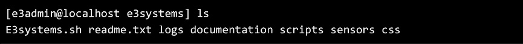
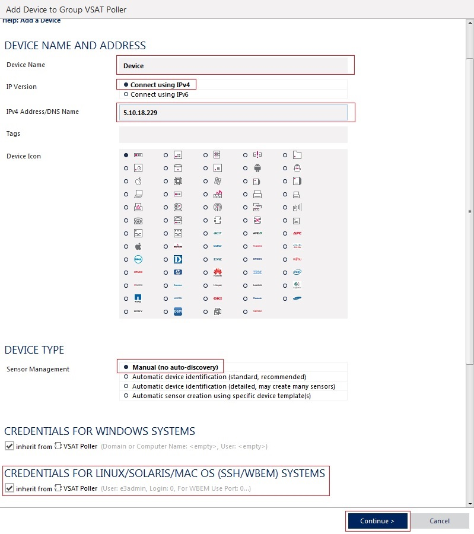
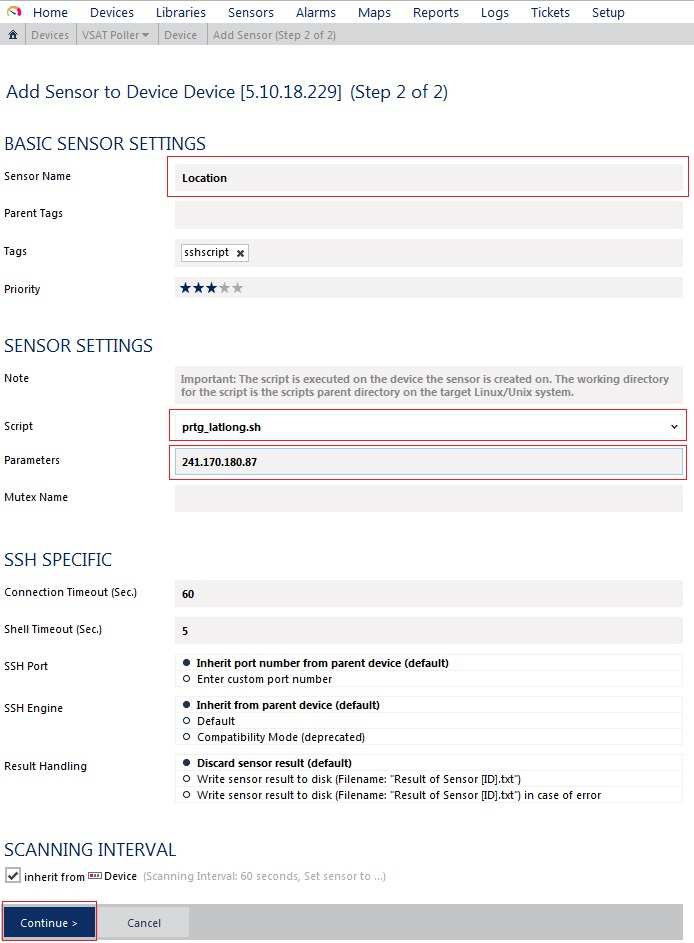

#Linux Documentation

###Description
The linux machine serves as a proxy data gathering server for PRTG connecting to each IP address added as a cronjob via telnet, gathering location, Signal and Beam every 5 minutes as well as gathering ping and packet loss data every 30 seconds. Data pulled from each IP address is stored in a MYSQL database (e3db) table (e3tb). Custom PRTG sensors are used to pull the gathered data from the MYSQL database and update the values and messages for each sensor.

Project files are located inside /home/e3admin/e3systems/

Add a new IP address by running the following custom command:
*ip_add ipaddress username password*

Remove an IP address by running the following custom command:
*ip_del ipaddress*

<< PRTG Documentation >>

-- Adding a Device --

1 - Enter a desired name for device under “Device Name”.

2 - Select “Connect using IPv4” under “IP Version”.

3 - Under “IP Address/DNS Name”, enter the linux server’s IP address.

4 - Set “Sensor Management” to “Manual (no discovery)”.

5 - Make sure “Credentials for Linux/Solaris/Mac OS (SSH/WBEM) Systems” is selected.

6 - Click “Continue” to go to add the new device.

-- Adding a Custom Sensor --

1 - Under “Monitor What?” select “Custom Sensors”.

2 - Under “Target System Type” select “Linux/MacOS”.

3 - Select “SSH Script Advanced” and click “Add This”.

4 - Enter desired sensor name under “Sensor Name”.

5 - Select relevant script from drop down list under “Script”.

6 - Enter the IP address that will be monitored under “Parameters”.

7 - Click “Continue” to go to add the new custom sensor.

-- Adding a Custom Map Object --

1 - Select the sensor created from the previous steps from the “Device Tree” on the  left side.

2 - Select the “Status Icons” list from the “Properties” section on the right side.

3 - Find the desired custom map object “custom_message_e3systems” and drag to the map.

-- Instructional screenshots provided on next pages --

-- Adding a Device --

-- Adding a Custom Sensor --

-- Adding a Custom Sensor continued on next page --

-- Adding a Custom Map Object --

-- End of PRTG Documentation --
