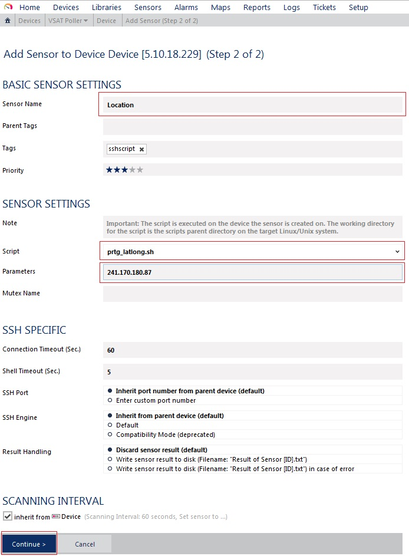

#CentOS 7 Server Documentation

###Description
The CentOS 7 server serves as a proxy data gathering server for PRTG Network Monitor connecting to each IP address added as a cronjob via telnet, gathering location, Signal and Beam data every 5 minutes as well as gathering ping and packet loss data every 30 seconds. Data pulled from each IP address is stored in a MYSQL database on the CentOS 7 server. Custom PRTG SSH sensors are used to pull the gathered data for each IP address from the MYSQL database and update the values, messages and control room map for each sensor on PRTG Network Monitor.

---
 
###Project Files Location

Project files are located inside ***/home/e3admin/e3systems/***

---
 
###Adding an IP Address

Add a new IP address by running the following custom command: ***ip_add ipaddress username password***

---
 
###Removing an IP Address

Remove an IP address by running the following custom command: ***ip_del ipaddress***

---
 
#PRTG Network Monitor Documentation

###Adding a Device

***Step 1*** - Enter a desired name for device under “Device Name”. 
***Step 2*** - Select “Connect using IPv4” under “IP Version”. 
***Step 3*** - Under “IP Address/DNS Name”, enter the linux server’s IP address. 
***Step 4*** - Set “Sensor Management” to “Manual (no discovery)”. 
***Step 5*** - Make sure “Credentials for Linux/Solaris/Mac OS (SSH/WBEM) Systems” is selected. 
***Step 6*** - Click “Continue” to go to add the new device. 

---
 
###Adding a Custom Sensor

***Step 1*** - Under “Monitor What?” select “Custom Sensors”. 
***Step 2*** - Under “Target System Type” select “Linux/MacOS”. 
***Step 3*** - Select “SSH Script Advanced” and click “Add This”. 
***Step 4*** - Enter desired sensor name under “Sensor Name”. 
***Step 5*** - Select relevant script from drop down list under “Script”. 
***Step 6*** - Enter the IP address that will be monitored under “Parameters”. 
***Step 7*** - Click “Continue” to go to add the new custom sensor. 

---
 
###Adding a Custom Map Object

***Step 1*** - Select the sensor created from the previous steps from the “Device Tree” on the  left side. 
***Step 2*** - Select the “Status Icons” list from the “Properties” section on the right side. 
***Step 3*** - Find the desired custom map object “custom_message_e3systems” and drag to the map. 

---
